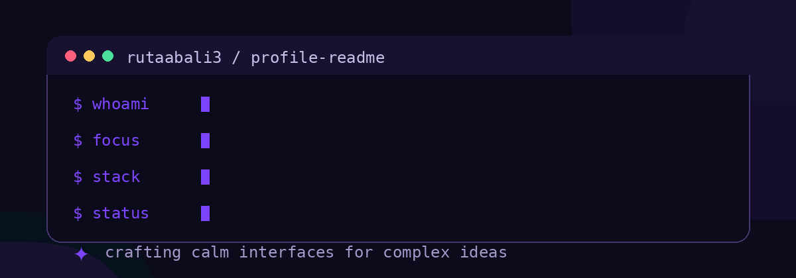

# Muhammad Rutaab Ali

### Web Developer · E-commerce & SEO Specialist

I build **responsive web experiences**, practical **e-commerce tools**, and search-friendly digital products that help ideas become useful.

  
  
  
  

## A little about me

I’m **Muhammad Rutaab Ali**, a web developer who enjoys the intersection of thoughtful interfaces, reliable functionality, and measurable online visibility. My work spans front-end development, PHP and Laravel applications, e-commerce listing management, and SEO-minded content structure.

> **My approach:** make the experience feel simple, make the system work hard, and make every detail earn its place.

<table>
<tr>
<td width="50%" valign="top">

### What I do

- Build clean, responsive websites and interactive pages.
- Develop practical web solutions with JavaScript, PHP, Laravel, and ASP.NET.
- Manage e-commerce listings, metadata, pricing, and inventory details.
- Shape search-friendly structures that make content easier to discover.

</td>
<td width="50%" valign="top">

### Currently focused on

- Improving JavaScript depth and front-end craft.
- Creating useful digital experiences for real businesses.
- Exploring better UI patterns and scalable application structure.
- Turning rough ideas into polished, working interfaces.

</td>
</tr>
</table>

## Toolkit

These are the same visual technology icons used in the **Skills & Tech Stack** section of my portfolio.

<table>
<tr>
<td align="center"> HTML5</td>
<td align="center"> CSS3</td>
<td align="center"> JavaScript</td>
<td align="center"> TypeScript</td>
<td align="center"> PHP</td>
<td align="center"> C#</td>
<td align="center"> Laravel</td>
</tr>
<tr>
<td align="center"> ASP.NET</td>
<td align="center"> Bootstrap</td>
<td align="center"> Tailwind CSS</td>
<td align="center"> MySQL</td>
<td align="center"> Git / GitHub</td>
<td align="center"> SEO</td>
<td align="center"> E-Commerce</td>
</tr>
</table>

## Selected work

| Project | What it is | Built with |
|:--|:--|:--|
| **BridgeX** | A visual platform exploring remarkable bridges, their engineering, and historical significance. | HTML |
| **bilal** | A personal website with custom design and interactive features. | JavaScript |
| **HomeDecor** | A home-decoration experience for catalogs, ideas, and interior inspiration. | CSS |

## Experience snapshot

| Period | Focus |
|:--|:--|
| **2023 – 2024** | Social media sales and customer support — managing inquiries, resolving customer questions, responding to leads, and securing sales orders. |
| **2024 – Present** | E-commerce and listing management for the company website — optimizing product descriptions and pricing, and updating inventory. |
| **2024 – Present** | Search engine optimization — using keyword analysis and metadata optimization to improve product search visibility. |
| **2024 – Present** | E-commerce and listing management on eBay — updating stock, descriptions, and pricing. |
| **2025 – Present** | Content assistance — creating video and image content to promote products and organizing digital assets. |

## Let’s build something useful

Have a project in mind, need a website, or want to discuss e-commerce and SEO optimization? I’d be glad to hear what you’re working on.

<a href="https://rutaabali3.vercel.app/"><strong>Visit my portfolio →</strong></a>

 
 

Designed with intention. Built with curiosity. Always improving.

